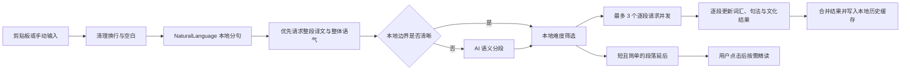

<p align="center">
  
</p>

<h1 align="center">Reddict</h1>

<p align="center">
  常驻 macOS 菜单栏的多语言语境助手：翻译字面，也解释语气、句法、文化和真正自然的表达方式。
</p>

Reddict 是一个使用 SwiftUI 与 AppKit 构建的 macOS 原生应用。它把「精读」「怎么回」和「How To Say」集中到一个随叫随到的浮窗中，适合阅读外语文章、聊天消息、论坛内容和任何需要理解上下文的文本。

## 功能概览

| 模式 | 适用场景 | 输出 |
| --- | --- | --- |
| 精读 | 读懂外语原文及其隐含意思 | 整段译文、逐句译文、难度、句法骨架、彩色成分、重点词汇、文化/词源、俚语与梗 |
| 怎么回 | 为聊天或讨论快速组织回复 | 语境判断，以及幽默、严谨、温暖、辩论四种自然回复 |
| How To Say | 把自己的意思转换成地道外语 | 多种可配置文风的表达、回译和用法提示，支持语音输入 |

其他能力：

- 菜单栏常驻，不占用 Dock；浮窗可跨桌面并保持在其他应用上方。
- 支持剪贴板、手动输入、全局快捷键和 macOS「服务」菜单。
- 内置 DeepSeek、Gemini、Kimi、CLI-Proxy 预设，并支持任意 OpenAI-compatible Chat Completions API。
- 精读、怎么回和 How To Say 可以分别绑定不同的服务商与模型。
- 支持中文、英文界面，以及经模型生成并保存的额外界面语言。
- 学习语言、翻译目标、解释语言和学习水平彼此独立；支持 CEFR、JLPT 和自定义语言。
- 本地历史兼作查询缓存，相同输入和配置可直接恢复，避免重复消耗 Token。

## 主要逻辑

### 1. 输入与模式调度

应用启动后以 `LSUIElement` 方式运行，由 `AppDelegate` 创建菜单栏入口、注册全局快捷键，并把所有操作交给唯一的 `FloatingPanelController`。输入可以来自：

- 当前剪贴板；
- 浮窗内的文本编辑器；
- 选中文字后的「右键 → 服务 → Reddict」；
- How To Say 中的 Apple Speech 语音转写。

同一功能的快捷键再次按下会隐藏浮窗；另一个功能的快捷键会在原窗口内切换模式。若请求仍在执行、文本尚未提交，或设置/历史弹层已打开，窗口不会被新的剪贴板内容意外覆盖。

### 2. 渐进式精读管线

精读采用“先给可用答案，再补充深度信息”的渐进式流程：



具体策略：

1. `TextSegmenter` 先修复 PDF、终端和窄栏网页复制时产生的视觉换行，再使用 `NaturalLanguage.NLTokenizer` 按完整句子划分。
2. 整段译文拥有最高优先级，先返回完整翻译、源语言和整体语气，不等待词汇与句法分析。
3. 只有长文本缺少明确边界时才调用模型重新做语义分段；失败时自动回退到本地结果。
4. 根据段落长度与本地难度分数挑选值得自动深挖的内容，简单短句保留为“按需分析”。
5. 深度分析以单段为批次，最多同时运行 3 个请求；每段独立展示排队、分析中、完成或失败状态。
6. 整段译文会在本地切分并与原句对齐。点击原文或译文中的任意句子即可打开同一段的详情，不会为了选句再次请求翻译。
7. 模型返回截断或 JSON 不完整时，会以更保守的参数自动重试；单段失败不会丢失其他已完成结果。

### 3. 回复与表达生成

「怎么回」把输入视为聊天语境，先生成简短的语境判断，再输出四种固定人格的回复，每条包含原语言回复、界面语言释义和语气说明。

How To Say 接受任意语言或混合语言输入，根据目标语言和已启用文风生成多个版本。文风不是写死在界面中的选项：用户可以启用、停用、新增、改名、编辑 Prompt、删除或恢复预设。语音按钮只负责把识别结果写入编辑器，停止录音后不会自动发送。

### 4. 配置、请求与缓存

- `LLMConfigurationStore` 使用 `UserDefaults` 保存各服务商的 Base URL、模型、JSON Mode 以及功能路由。
- `APIKeyStore` 只读取和写入 Reddict 自己的 macOS Keychain 项目，不扫描环境变量或其他钥匙串条目。
- `LLMClient` 统一调用 OpenAI-compatible `/chat/completions`，并可通过 `/models` 刷新模型列表。
- 远程端点必须使用 HTTPS；HTTP 仅允许 `localhost`、`127.0.0.1` 和本机 IPv6 地址。请求不会自动跟随跨主机重定向，错误内容会脱敏 API Key。
- `HistoryStore` 根据输入、模式、目标语言、服务商、Base URL、模型、JSON Mode、学习偏好和缓存版本计算 SHA-256 键。最多保留 300 条记录。
- 精读只有在全部自动分析段成功后才写入缓存；失败的局部结果仍可留在当前界面，但不会污染下一次查询。

## 页面与 UI/UX 设计

### 浮窗框架

Reddict 使用一个可复用的 `NSPanel` 承载 SwiftUI 内容。默认尺寸为 `570 × 720`，可在 `500 × 580` 到 `720 × 900` 之间调整；首次唤起时靠近鼠标定位，并自动限制在当前屏幕可见区域内。

视觉语言以系统 HUD 毛玻璃为底，叠加低饱和紫色到珊瑚色渐变。珊瑚红是全局强调色，用于主操作、选中状态、进度和重要标签；圆角卡片、胶囊标签与系统 SF Symbols 保持轻量、原生的 macOS 观感，同时自动适配深浅色外观。

### 信息架构

```text
┌──────────────────────────────────────────────┐
│ 品牌与说明        当前模式 / 模型   历史  设置 │
├──────────────────────────────────────────────┤
│ 输入区：剪贴板 / 手动编辑 / 语音 / 目标语言   │
├──────────────────────────────────────────────┤
│          精读  ·  怎么回  ·  How To Say       │
├──────────────────────────────────────────────┤
│                                              │
│  状态提示 + 可滚动结果区                      │
│  整段译文 / 逐句详情 / 回复卡 / 表达卡         │
│                                              │
├──────────────────────────────────────────────┤
│ 输入来源提示             历史缓存 / 当前模式   │
└──────────────────────────────────────────────┘
```

- **顶部**：品牌、产品定位、当前功能所用模型，以及历史和设置入口。
- **输入区**：精读/回复共用可编辑原文框；How To Say 使用更高的独立编辑器，并在同一区域完成目标语言、录音和生成操作。
- **模式切换**：三段式切换器复用同一个窗口，模式切换不会制造多个浮窗。
- **内容区**：统一处理空状态、加载、渐进式进度、失败和缓存恢复；结果按任务类型切换卡片结构。
- **底部**：持续提示输入方式、当前模式，以及“来自历史 · 0 Token”等低打扰状态。

### 精读交互

- 整段译文完成后立即显示；后台继续分析时，顶部状态行实时报告完成数量和并发任务数。
- 原文与译文按句建立同一套可点击区域。悬停会同步高亮句子，点击后切换到该句详情；“查看整段译文”可以随时返回总览。
- 详情卡先展示原句和句译，再解释“为什么难懂”。句法成分直接嵌入原句，以不同颜色表示角色；点击成分即可在下方查看说明。
- 句法、不同解析、词汇、文化/词源和俚语模块可独立折叠，减少长结果的滚动负担。
- 每段都有难度标记和复制按钮；延后分析的短句可由用户单独触发，不强迫为简单内容付出 Token。

### 回复、表达与设置

- 回复和 How To Say 都使用一条建议一张卡的形式，通过图标、色彩和文风名称建立快速扫读层级，并在每条结果右上角提供复制操作。
- 设置以遮罩弹层覆盖当前任务，不离开主上下文。内容按语言、自定义语言、学习水平、显示过滤、How To Say 目标/文风和 API 配置分组。
- 新增软件语言时，当前模型会翻译应用内置字符串并保存在本地；新增自定义语言前会先验证其真实性、可翻译性和当前模型的分析能力。
- API 配置必须先通过连接测试才能保存；模型列表既可在线刷新，也允许手动输入兼容端点提供的模型名。
- 历史弹层支持搜索、恢复单条任务和清空全部记录。危险操作使用二次确认，API 配置不受历史清理影响。

### 反馈与可访问性

- 加载、分段、排队、失败、缓存命中和语音权限均有明确的文字状态，不只依赖颜色表达。
- 输入框支持 `⌘ Return` 提交；主要图标按钮提供 Tooltip 和 Accessibility Label。
- 结果文本可选择，每个可复用结果单元均提供单独复制；鼠标悬停、选中和键盘操作拥有一致的视觉反馈。

## 快捷键

| 功能 | 快捷键 |
| --- | --- |
| 翻译 / 精读 | `⌃⌥⌘T` |
| 怎么回 | `⌃⌥⌘L` |
| How To Say | `⌃⌥⌘H` |

再次按当前功能的快捷键会隐藏浮窗；按另一个快捷键会切换功能。也可以选中文字后使用「右键 → 服务 → Reddict」。

## 技术架构

| 模块 | 职责 |
| --- | --- |
| `ReddictApp.swift` | 应用生命周期、菜单栏、快捷键和 Services 注册 |
| `FloatingPanelController.swift` | 单浮窗生命周期、切换策略、屏幕定位 |
| `AnalysisView.swift` | 主界面、结果卡、设置与历史弹层、AppKit 文本交互桥接 |
| `AnalysisViewModel.swift` | 三种模式状态机、任务取消、渐进式精读、配置与历史协调 |
| `TextSegmenter.swift` | 换行归一化、本地分句、难度评估、译文对齐和批次规划 |
| `LLMClient.swift` | OpenAI-compatible 网络请求、Prompt、JSON 解码、恢复重试和模型发现 |
| `AnalysisModels.swift` | 精读、句法、词汇、回复、表达等领域模型 |
| `LearnerPreferences.swift` | 语言、水平、显示过滤、文风和界面本地化偏好 |
| `HistoryStore.swift` | 本地历史、SHA-256 缓存键、条数限制和权限加固 |
| `APIKeyStore.swift` | Reddict 专属 Keychain 凭据读写 |
| `VoiceInputTranscriber.swift` | Apple Speech 权限、录音和转写状态 |

## 系统要求

- macOS 15.0 或更高版本
- 包含 macOS 15 SDK 的 Xcode
- 至少一个可用的 OpenAI-compatible API Key

## 本地运行

克隆并打开工程：

```bash
git clone https://github.com/BertieJim/Reddict.git
cd Reddict
open Reddict.xcodeproj
```

在 Xcode 中选择 `Reddict` scheme 后运行。首次启动时，从菜单栏打开「语言、显示与 API 设置」：

1. 选择服务商，或填写自定义 Base URL。
2. 输入 API Key 和模型名；需要时刷新模型列表。
3. 点击「测试连接」。
4. 为精读、怎么回和 How To Say 选择对应配置，然后保存。
5. 设置界面语言、翻译目标、学习语言与水平。

也可以使用命令行构建：

```bash
xcodebuild -project Reddict.xcodeproj \
  -scheme Reddict \
  -configuration Debug \
  -derivedDataPath DerivedData \
  build

open DerivedData/Build/Products/Debug/Reddict.app
```

## 隐私与权限

- API Key 保存在 macOS Keychain 中，只在发起用户请求时发送给所选 API 服务商。
- 历史位于当前用户的 Application Support 目录；目录权限设为 `700`，历史文件权限设为 `600`。
- 麦克风与语音识别权限只在点击 How To Say 的语音按钮后请求。
- App Sandbox 只声明出站网络和麦克风输入权限。
- 项目不包含 API Key、`.env`、签名私钥、构建目录或归档产物。

## 开发与验证

格式化 Swift 源码：

```bash
xcrun swift-format format --in-place --recursive Reddict Tests
```

运行本地 smoke tests：

```bash
Scripts/run-smoke-tests.sh
```

测试覆盖语言偏好迁移、分句与译文对齐、功能/API 路由、私有历史文件、模型列表解析、安全错误脱敏、快捷键切换和语音区域选择。

## 项目结构

```text
Reddict/
├── Reddict/                 AppKit / SwiftUI 应用源码与资源
├── Tests/                   可独立编译运行的 smoke tests
├── Scripts/                 本地开发辅助脚本
├── Reddict.xcodeproj/       Xcode 工程与共享 scheme
├── ExportOptions.plist      App Store Connect 导出配置
└── README.md
```

Bundle ID：`com.archest.reddict`
